# MovieLens 32M - End-to-End Data Engineering & Sentiment Analysis Pipeline

📌 Project Overview

This project is a complete, cloud-based data engineering pipeline built using the MovieLens 32M dataset. It demonstrates how to design, build, and visualize large-scale data workflows using Google Cloud technologies, with a final goal of delivering actionable insights through an interactive Looker Studio dashboard.

Alongside standard rating analytics, this project also includes sentiment analysis on user-generated movie tags, pushing the pipeline into NLP territory.

📦Dataset Summary

Source: [MovieLens 32M](https://grouplens.org/datasets/movielens/)

| Feature        | Details               |
|----------------|-----------------------|
| **Users**      | 200,948               |
| **Movies**     | 87,585                |
| **Ratings**    | 32,000,204            |
| **Tags**       | 2,000,072             |
| **Time Period**| Jan 9, 1995 – Oct 12, 2023 |
| **Files Used** | ratings.csv, movies.csv, tags.csv |

All data is anonymized and does not contain any demographic or personally identifiable information.
---

🧱 Tech Stack

| Layer           | Tools / Technologies              |
|-----------------|-----------------------------------|
| **Data Storage**| Google Cloud Storage (GCS)        |
| **Data Warehouse** | Google BigQuery                |
| **Processing**  | SQL, Python, BigQuery Notebooks   |
| **Visualization** | Looker Studio                   |
| **NLP**         | TextBlob (for sentiment analysis) |

🗂️ Data Pipeline Architecture

## 🔄 ETL Pipeline Process

### Ingest:

- **Uploaded raw CSV files** to Google Cloud Storage bucket (`raw/` folder).
- **Created external tables** in BigQuery to link GCS files without duplication.

### Transform:

- **Converted UNIX timestamps** to human-readable dates.
- **Built normalized fact and dimension tables** in the `movielens_clean` dataset.
- **Aggregated sentiment scores** from user tags using **TextBlob** (via Python).

### Model:

- **Designed a clean star schema** for the dataset.
- **Created dashboard-ready views** such as `ratings_enriched` and `sentiment_enriched`.

### Visualize:

- **Connected Looker Studio** to BigQuery.
- **Built charts** for:
  - Top-rated movies
  - Rating trends over time
  - Genre-wise breakdowns
  - Sentiment-based rankings (positive/polarizing)

🧠 Data Modeling (Star Schema)

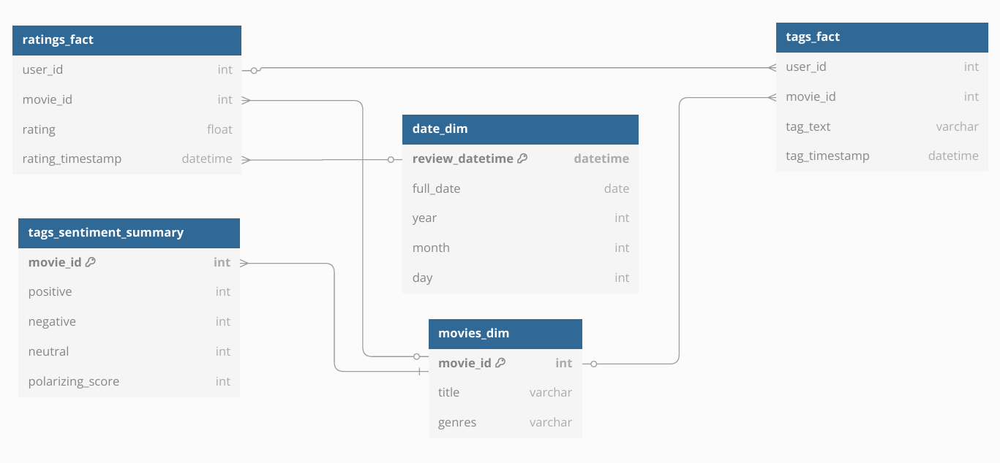

## 🟨 ratings_fact

| Column            | Description                                   |
|-------------------|-----------------------------------------------|
| user_id           | ID of the user                                |
| movie_id          | ID of the movie                               |
| rating            | Rating (0.5 to 5.0)                           |
| rating_timestamp  | When the rating was submitted                 |

## 🟩 movies_dim

| Column   | Description                                |
|----------|--------------------------------------------|
| movie_id | Unique movie ID                           |
| title    | Movie title with release year             |
| genres   | Pipe-separated genres (e.g. Drama|Action) |

## 🟦 date_dim

| Column    | Description               |
|-----------|---------------------------|
| date_id   | UUID or derived timestamp |
| full_date | YYYY-MM-DD format         |
| year      | Year                      |
| month     | Month                     |
| day       | Day                       |

## 🟧 tags_fact

| Column         | Description                                |
|----------------|--------------------------------------------|
| user_id        | User who submitted the tag                 |
| movie_id       | Movie associated with the tag             |
| tag_text       | Free-text tag content                     |
| tag_timestamp  | Timestamp of tag submission               |

## 🔍 tags_sentiment_summary

| Column          | Description                                  |
|-----------------|----------------------------------------------|
| movie_id        | Movie ID                                     |
| positive        | Count of positive tags                       |
| negative        | Count of negative tags                       |
| neutral         | Count of neutral tags                        |
| polarizing_score| Sum of positive + negative                   |

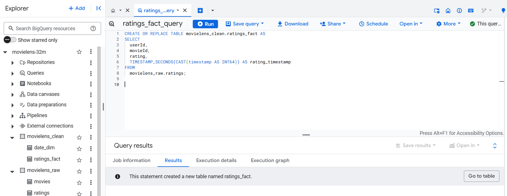
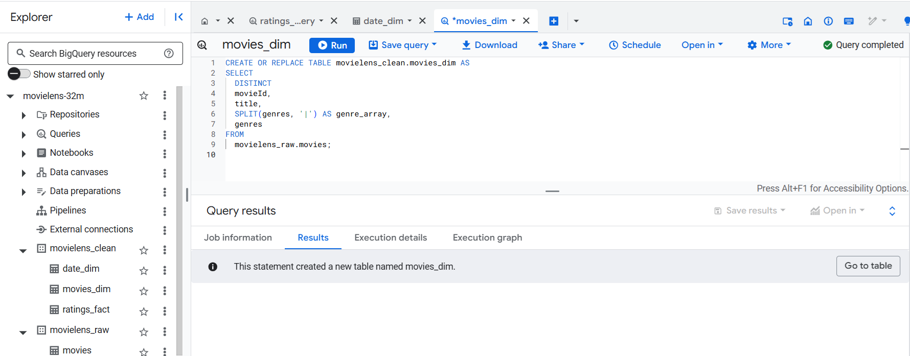
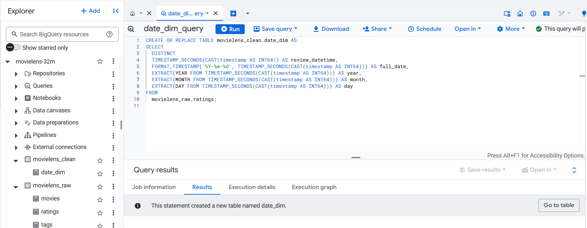
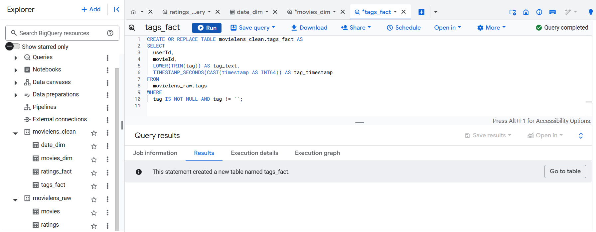
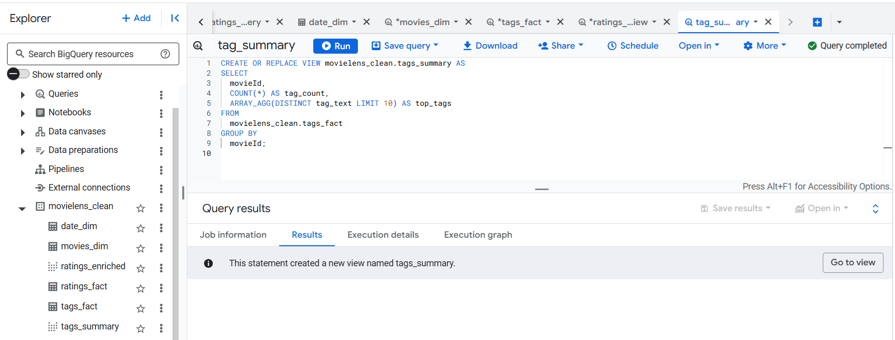

## 🎯 Goal: Sentiment Analysis on Movie Tags

### Data We’ll Use:
The **movielens_clean.tags_fact** table contains the following columns:

| Column        | Example            |
|---------------|--------------------|
| userId        | 234                |
| movieId       | 102                |
| tag_text      | "masterpiece"      |
| tag_timestamp | 2021-03-04         |

### 💡 Approach (BigQuery + Python Notebook)

**Extract Data from BigQuery**:
   - Use BigQuery to extract `tag_text` data from the `tags_fact` table for sentiment analysis.
   - Query the table for tags that are relevant or for a particular time period.

**Sentiment Analysis with Python**:
   - Use a Python Notebook to process the extracted tag text.
   - Leverage the **TextBlob** library (or another NLP tool) to analyze the sentiment of each tag text.
   - Classify the sentiment as **positive**, **negative**, or **neutral** based on the sentiment polarity score.

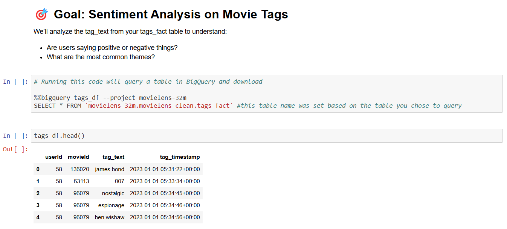  
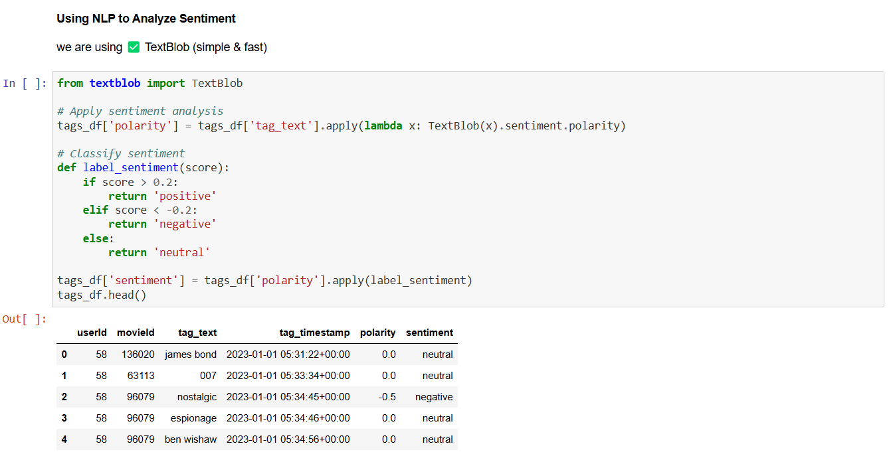  
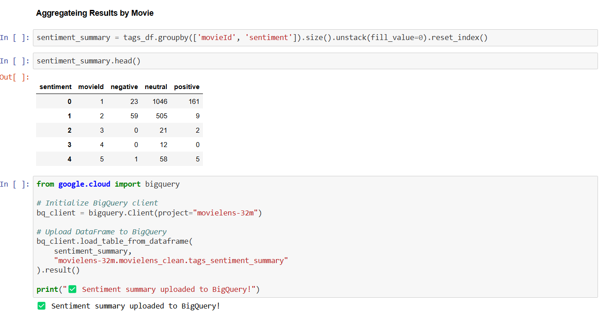  

###  📊 Analytics You Can Perform (Real-Time Queries)
###  🔶 From ratings_fact + movies_dim + date_dim

1️⃣ Top 5 Most Rated Movies

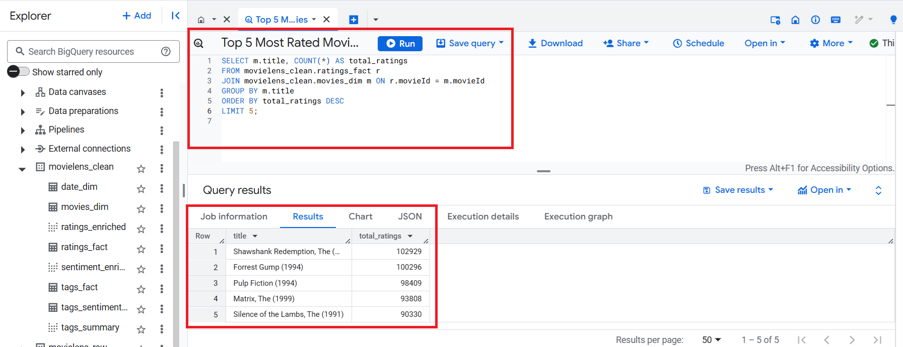 

2️⃣ Average Rating by Genre

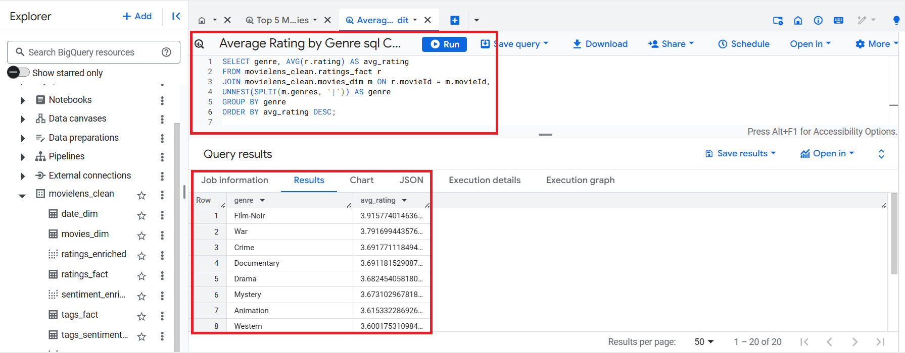 

3️⃣ Monthly Rating Trends

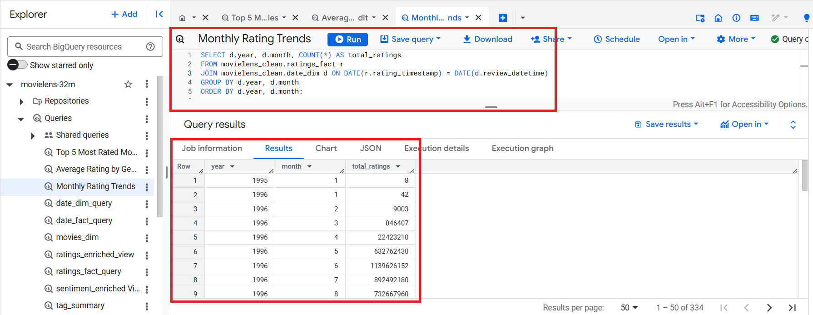 

### 🟪 From tags_fact + tags_sentiment_summary

4️⃣ Top 1 Polarized Movie (positive + negative tags)

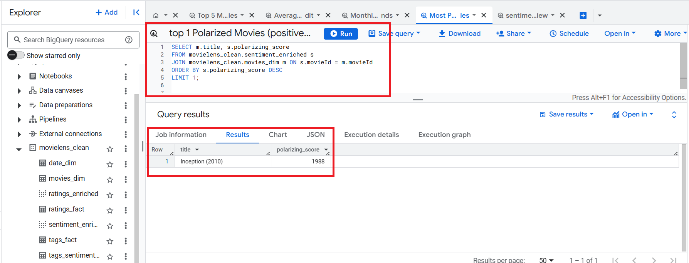 

5️⃣ Most Used Tags

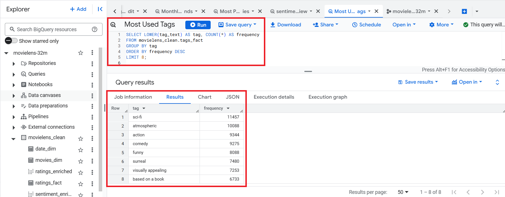 

### 🟩 From tags_fact + date_dim

6️⃣ Tag Volume Over Time

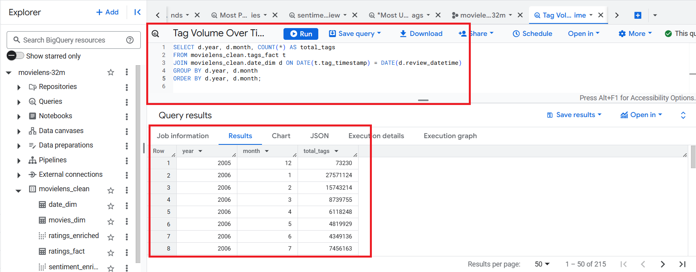 

---

## 🧠 Dashboard Summary

### 🎬 1. Interactive Movie Ratings Dashboard

#### What it shows:

- **📊 Genre TreeMap with average ratings**: A visual representation of movie genres with the average rating displayed for each genre.
  
- **📅 Ratings over time, grouped by genre & year**: A time series view that allows users to explore how ratings have evolved over time, categorized by genre and year.

- **🏆 Most Reviewed Movies bar chart**: A bar chart showcasing the movies with the most number of reviews, highlighting popular movies across the platform.

- **⭐ Top Genres by Average Rating (sortable)**: A sortable table of movie genres ranked by their average rating, allowing users to explore which genres are performing the best.

#### 🎯 KPI Cards:
- **Avg Ratings for selected genres**: Displays the average ratings for specific genres such as **Fantasy**, **Comedy**, and **Action**, helping users understand the best-rated genres.
  
- **Total Record Count**: Shows the total number of movie ratings or records available in the dataset, providing a quick snapshot of the dataset's scale.

#### Insights Enabled:

- **Which genres dominate by rating & count**: Users can easily identify the genres that have the highest average ratings and the most reviews, helping to see where both quality and quantity align.

- **Movie popularity vs. quality**: The dashboard enables a comparison between movie popularity (total review count) and movie quality (average rating), providing insight into which movies are both popular and highly rated.

- **Ratings trend evolution over years**: A detailed view of how ratings have changed over time, giving users an understanding of trends in movie reviews and how they evolve across different years and genres.

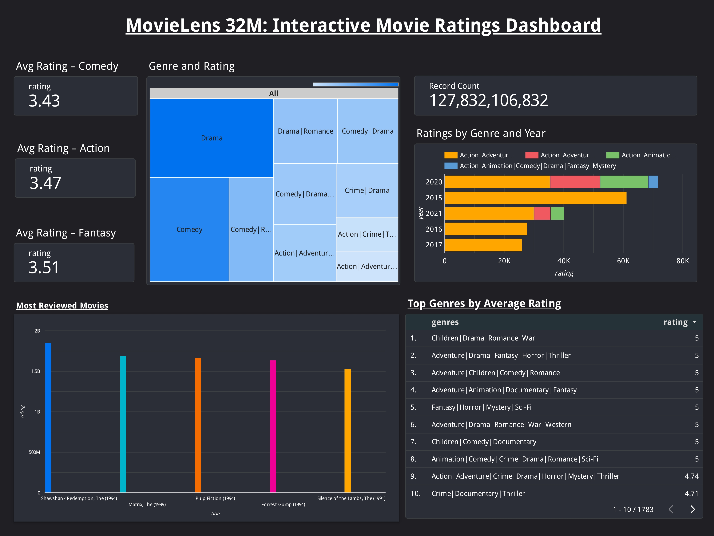 

 ## 💬 2. Sentiment Dashboard (from Tags)

#### What it shows:

- **📊 Sentiment Split (positive, neutral, negative) by movie**: A visual breakdown of the sentiment distribution (positive, neutral, negative) for each movie based on user-generated tags.

- **🏆 Top Positively Tagged Movies**: A list or chart showcasing movies with the highest number of positive tags, indicating films that resonate most positively with viewers.

- **🧨 Most Polarizing Movies**: A ranking of movies with the highest polarizing scores (a balance of both positive and negative tags), highlighting films that evoke strong reactions from audiences.

- **📉 Genre-wise Breakdown of Negative Tags**: A visualization showing the distribution of negative tags across genres, allowing users to see which genres tend to have more negative sentiment.

- **🔢 Sentiment tag totals (positive, neutral, negative)**: Displays the total number of positive, neutral, and negative tags submitted by users, giving an overall sentiment summary.

#### Insights Enabled:

- **How people feel about movies, not just what they rate**: This dashboard goes beyond ratings to show how people emotionally react to movies through their tags, offering a deeper insight into audience sentiment.

- **Tag-driven audience sentiment beyond star ratings**: It allows users to explore sentiment from tags, offering an additional layer of understanding of how people perceive movies, independent of their rating.

- **Polarizing vs universally liked films**: The dashboard helps identify movies that split opinions (polarizing) versus those that receive more consistent positive feedback (universally liked).

- **Genre-wise perception analysis**: A deep dive into how different genres are perceived emotionally by the audience, revealing whether certain genres are more likely to receive positive or negative sentiment.

 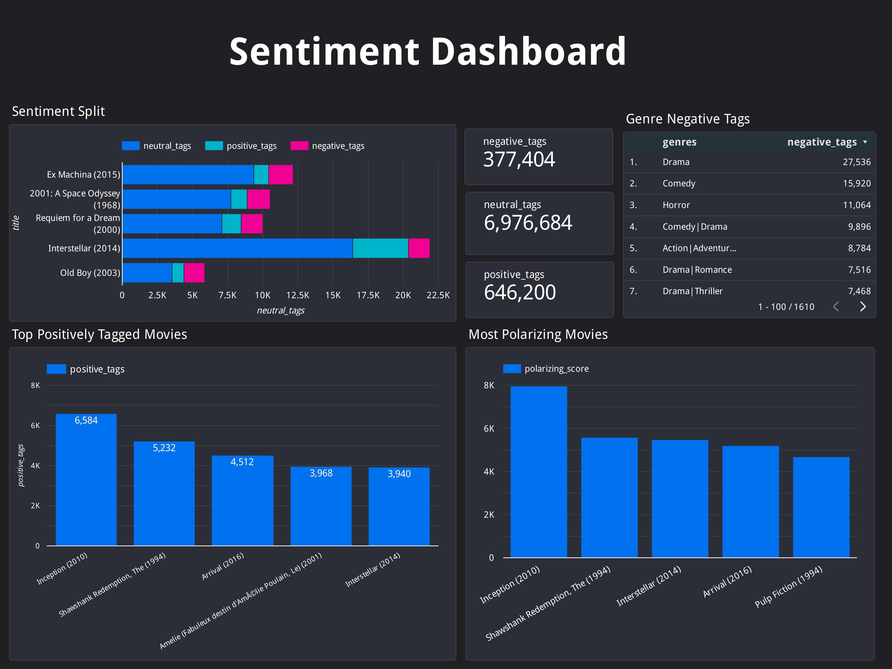 

## 📚 Citation & License

This dataset is provided by **GroupLens Research**, University of Minnesota.  
Use is permitted for research under their license.

### Citation:
Harper, F. M., & Konstan, J. A. (2015). The MovieLens Datasets: History and Context. *ACM Transactions on Interactive Intelligent Systems (TiiS)*, 5(4), 1–19. [https://doi.org/10.1145/2827872](https://doi.org/10.1145/2827872)

## 🙌 Author

**Jobit** – Data Engineer | Analyst | Movie Lover 🎬

Connect with me:  
[Website](http://databitwithjobit.com) | [LinkedIn](https://www.linkedin.com/in/j-james-73849b350/) 

