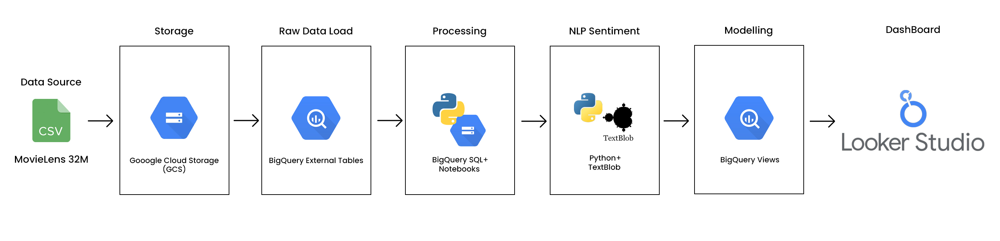

# MovieLens 32M - End-to-End Data Engineering & Sentiment Analysis Pipeline

📌 Project Overview

This project is a complete, cloud-based data engineering pipeline built using the MovieLens 32M dataset. It demonstrates how to design, build, and visualize large-scale data workflows using Google Cloud technologies, with a final goal of delivering actionable insights through an interactive Looker Studio dashboard.

Alongside standard rating analytics, this project also includes sentiment analysis on user-generated movie tags, pushing the pipeline into NLP territory.

📦 Dataset Summary

Source: [MovieLens 32M](https://grouplens.org/datasets/movielens/)

| Feature        | Details               |
|----------------|-----------------------|
| **Users**      | 200,948               |
| **Movies**     | 87,585                |
| **Ratings**    | 32,000,204            |
| **Tags**       | 2,000,072             |
| **Time Period**| Jan 9, 1995 – Oct 12, 2023 |
| **Files Used** | ratings.csv, movies.csv, tags.csv |

All data is anonymized and does not contain any demographic or personally identifiable information.
---

🧱 Tech Stack

| Layer           | Tools / Technologies              |
|-----------------|-----------------------------------|
| **Data Storage**| Google Cloud Storage (GCS)        |
| **Data Warehouse** | Google BigQuery                |
| **Processing**  | SQL, Python, BigQuery Notebooks   |
| **Visualization** | Looker Studio                   |
| **NLP**         | TextBlob (for sentiment analysis) |

#### Data Pipeline Architecture

🗂️ Architecture Diagram

